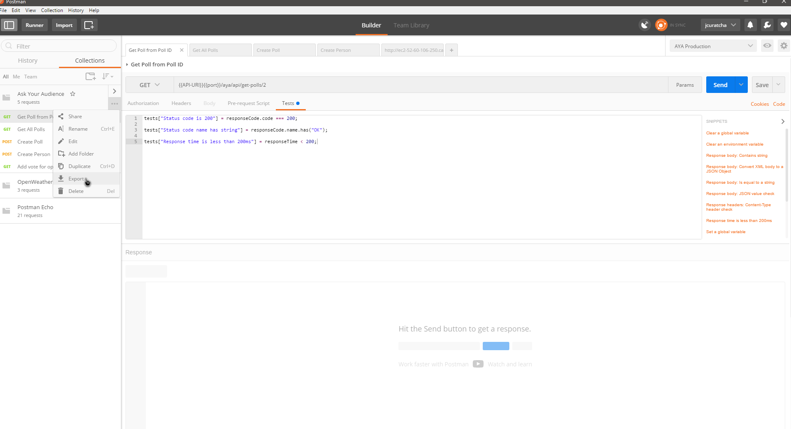
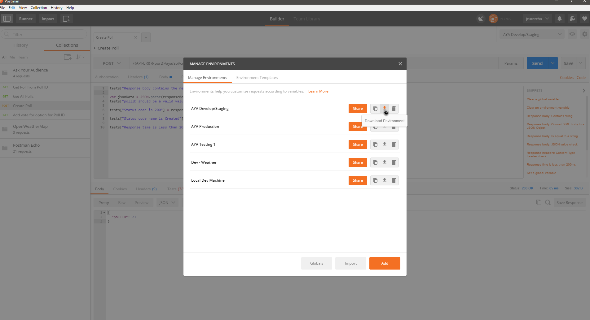
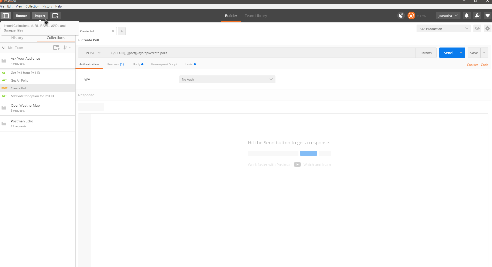
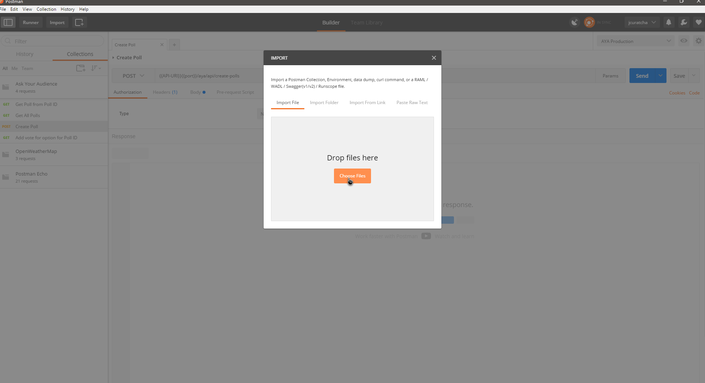

# Ask Your Audience

Production Web Server: http://ec2-52-60-106-250.ca-central-1.compute.amazonaws.com:3000

Production API Server: http://ec2-52-60-106-250.ca-central-1.compute.amazonaws.com:8080

Develop Web Server: http://ec2-54-213-112-197.us-west-2.compute.amazonaws.com:3000

Develop API Server: http://ec2-54-213-112-197.us-west-2.compute.amazonaws.com:8080

Testing Web Server: http://ec2-35-161-110-163.us-west-2.compute.amazonaws.com:3000

Testing API Server: http://ec2-35-161-110-163.us-west-2.compute.amazonaws.com:8080

Travis CI Builds page: https://travis-ci.com/jcuratcha/ask-your-audience

## Frontend Angular Web App Server Setup

### Prerequisites

- Install Node.js version 7.5 (should include npm during installation)
- Install MongoDB version 3.4.2

The web client is built and run independent from the backend API, but they must be run on the same machine at the same time, because the hostname of the webapp is used to access that instance's running backend server.

### Steps to run:

- Change directory into `ask-your-audience/web`
- Run `npm install`
- Run `npm run start` to build then start serving the webapp on port :3000

### How to run unit tests
- Change directory into `ask-your-audience/web`
- Run `npm install`
- Run `npm run test`


### How to run e2e tests
- Change directory into `ask-your-audience/web`
- Run `npm install`
- Run `npm run e2e`

## Backend API Server Setup

### Prerequisites

- Install Node.js version 7.5 (should include npm during installation)
- Install MongoDB version 3.4.2

### How to use MongoDB:

### Start the mongod service:
- Open a cmd window inside the bin folder for MongoDB (e.g. `C:\Program Files\MongoDB\Server\3.4\bin`)
- Type: `mongod.exe`
	- Optional: By default, the service will look at `\data\db\` on the root folder for database files, so to change it
		- add `--dbpath` to the command (e.g `mongod.exe --dbpath "Drive:\your\choosen\location"`)
- This cmd window must stay running to use the database
    
#### Playing around with the database:

In the same bin folder, but in a different cmd window:
- Type: `mongo.exe`

#### Basic commands:
- `show dbs` shows databases in database system
- `use <database name>` - create/switch to database
- `db` - show current database
- `show collections` - shows the collections/tables of the database
- `db.<collection name>.find()` - shows all the entries in the collection/table
- `db.<collection.name>.drop()` - deletes the collection and all its entries

### How to set up our application (so far)

#### To gather application dependencies:

- Open a new cmd window in the same directory as the "package.json" file
- Type: `npm install`
	- This should install all dependencies listed in the "package.json" file

#### To start server:

- In a cmd window at the same directory as above
- Type: node server.js
	- Alternatively: type npm start
		- This will execute  the start script defined in the "package.json" file
- This cmd window must stay running to use web server

#### To run tests:

##### Unit tests
- In a cmd window at the same directory as the "package.json" file (i.e. the `backend` directory)
- Type: npm test
- NOTE: Make sure the server is not running before starting tests

##### Postman tests (Command Line)
- You'll need to have [Newman](https://github.com/postmanlabs/newman) installed, to install this run `npm install newman --global`
- Make sure you're in this project's root folder
- Run `newman run "backend\test\Ask Your Audience.postman_collection.json" -e "backend\test\AYA Develop-Staging.postman_environment.json"` to run the Postman tests in the command line
- The test results should be displayed, along with stats on how many tests have succeeded or failed

##### Importing/Exporting Postman Collections
- To do the above step, you'll need to make sure that the Collection and the Environment json files exist. Their path relative to the project root should be `backend/test/Ask Your Audience.postman_collection.json` and `backend/test/AYA Develop-Staging.postman_environment.json`
	- This requires exporting the Postman Collection 
	- This also requires exporting/downloading the environment you want to use 
	- Make sure that the exported file is in the right folder and named correctly as above
	- Note: You might notice that the Environment file has "Devlop-Staging" in the name. This means that these Postman tests will be run against our Develop/Staging server. This is the current setup for our Postman tests, but this can be changed at any time after discussion if desired.
- If you want to edit the collection (say, if you wanted to update the collection), you'll need to import it into Postman
	- 
	- 

##### USEFUL INFO:
- The application should automatically create a database called aya
- The poll infomation should then be found in the polls collection of the aya database (i.e. db.polls.find())

## Mobile Setup

The mobile framework behind our Ask Your Audience mobile apps is [Telerik's NativeScript](https://www.nativescript.org/). 

### NativeScript Setup & Dependencies

In order to build and run the mobile clients from source, you'll need to have NativeScript installed.

- All of the steps needed to install NativeScript are outlined [here](http://docs.nativescript.org/start/quick-setup).
	- If you get any errors during installation or when trying to run the app, make sure you have these installed: 
		1. Node.js v4.4.x
		2. Java v1.8.x
		3. (Android) Android SDK 22 or later
		4. (Android) Android SDK Build-Tools 25.02 or later
	- Additionally, having an Android Virtual Device, or an Android device with USB debugging enabled is required to run the client.

### Running Ask Your Audience Mobile client:

To run the client, you'll need to clone the repository, change into the `mobile/ask-your-audience/` directory, then run the command to build. Here are the steps:
```bash
git clone https://github.com/jcuratcha/ask-your-audience.git #or, if you have valid SSH keys in GitHub, git clone git@github.com:jcuratcha/ask-your-audience.git
cd mobile/ask-your-audience
tns run android
```

This will start up an AVD/Android Emulator and install the app on that device. If an Android device with USB Debugging enabled is connected to the computer via USB, Ask Your Audience will be installed there instead, and the emulator will not be started.

### Running Unit Tests

To run the unit tests, make sure that the repository is cloned, and that you are in the `ask-your-audience` directory (just like when running the client in the section above).

Then, you can run `tns test android --justlaunch` to run the test suite. This will start the Android Emulator (if no physical devices connected), then run the tests and then exit.

If, after running tests, you would like to run the app normally, running `tns run android` should be sufficient. If running that command doesn't work and the test runner shows up instead, please run `rm -rf node_modules/ hooks/ platforms/` to delete those directories. Then, you should try running `tns run android` a second time. This will force NativeScript to redownload Node.js packages and reconstruct `hooks/` and `platforms/` and should allow the app to build and run normally.

### Troubleshooting

- If you get a message that looks like `Exception: The plugin tns-android@2.5.0 is already installed` when trying to run `tns run android`, follow these steps ([source](https://github.com/NativeScript/nativescript-cli/issues/2487)):
	- open the `package.json` in your text editor
	- remove the `tns-android` dependency under `"dependencies: {}"
	- remove the `android` entry from the `"nativescript: { }"` key if it's there
	- in the command line, run `npm cache clear`
	- then run `tns platform add android`
